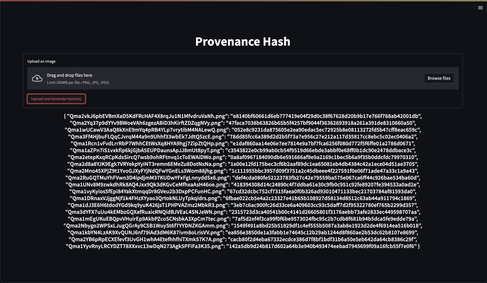

<div align="center">
    <h1>NFT Provenance</h1>
    <h3>🔥 NFT Images provenance hash generator and checker script.</h3>
</div>

<br>

<div align="center">
	| 
    <a href="https://vusal.substack.com">blog</a> | 
    <a href="https://gist.github.com/woosal1337">gist</a> | 
    <a href="https://github.com/woosal1337/dotfiles">dotfiles</a> |  
    <a href="https://www.reddit.com/user/woosal1337">reddit</a> | 
    <a href="https://keybase.io/woosal">keybase</a> | 
    <a href="https://t.me/woosal1337">telegram</a> |
    <a href="https://twitter.com/woosal1337">twitter</a> | 
    <a href="https://www.instagram.com/woosal1337/">instagram</a> |
    <a href="https://open.spotify.com/user/3pd70lv4jpyjbjxjfgysx3pzl">spotify</a> |
    <a href="https://discordapp.com/users/901937888688758785">discord</a> |
    <a href="mailto:woosal@pm.me">mail</a> |
</div>

# Contents
- [1. Introduction](#introduction)
- [2. Features](#features)
- [3. Setup](#setup)
- [4. Usage](#usage)
- [5. License](#license)


# Introduction
This script is used to generate and check the provenance hash of NFT images. It uses 
the SHA256 algorithm to generate the hash. `hashlib` library is used to generate the 
hash.

Project Structure:
```
├── LICENSE
├── README.md
├── app
│   ├── __init__.py
│   ├── __pycache__
│   │   └── main.cpython-39.pyc
│   ├── images
│   ├── main.py
│   └── streamlit_gui_app.py
├── docs
│   ├── README.md
│   └── __init__.py
├── pre-commit-config.yaml
├── requirements.txt
├── src
│   └── ss.png
└── tests
    └── __init__.py
```

# Features
- [x] Generate provenance hash of an image.
- [x] Check the provenance hash of an image.
- [x] Streamlit GUI app.
- [x] CLI app.
- [X] Multiple images support.

# Setup
1. Environment setup:
- The current code was run on Python 3.11.0, but it should work on Python 3.8+. Make 
  sure to create a virtual environment and install the required packages:
```zsh
$ python3 -m venv venv
$ source venv/bin/activate
$ pip install -r requirements.txt
```

2. Run the script in the correct path:
```zsh
$ cd app/
$ pwd

> nft-provenance-hash/app/
```

# Usage


Streamlit GUI app and Usage:
```zsh
$ pip install -r requirements.txt
$ cd app/

$ pwd

> nft-provenance-hash/app/

$ streamlit run streamlit_gui_app.py

>  You can now view your Streamlit app in your browser.

>  Local URL: http://localhost:8501
>  Network URL: http://192.168.1.114:8501
```

# License
- [MIT](LICENSE)